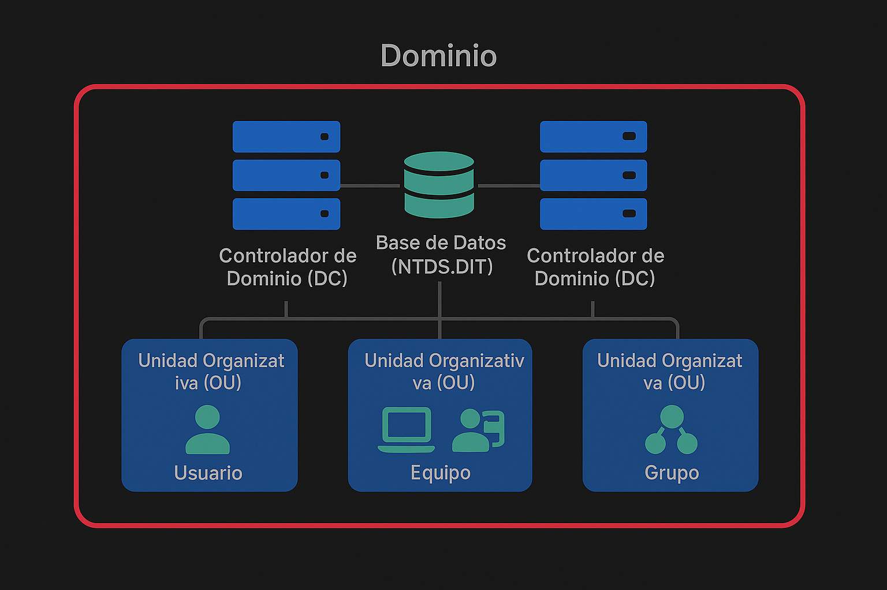
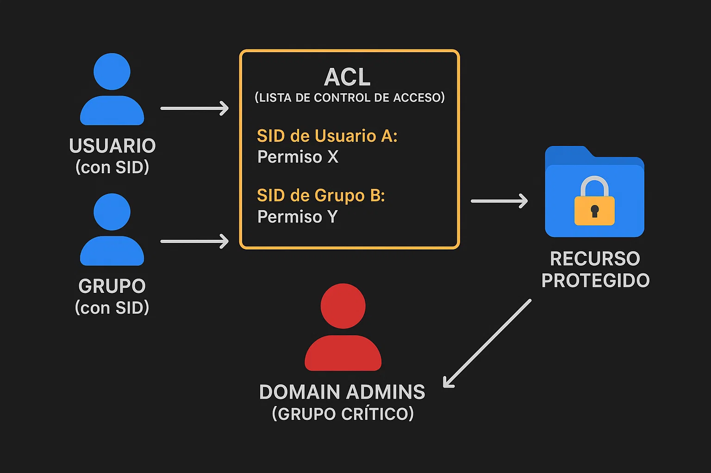
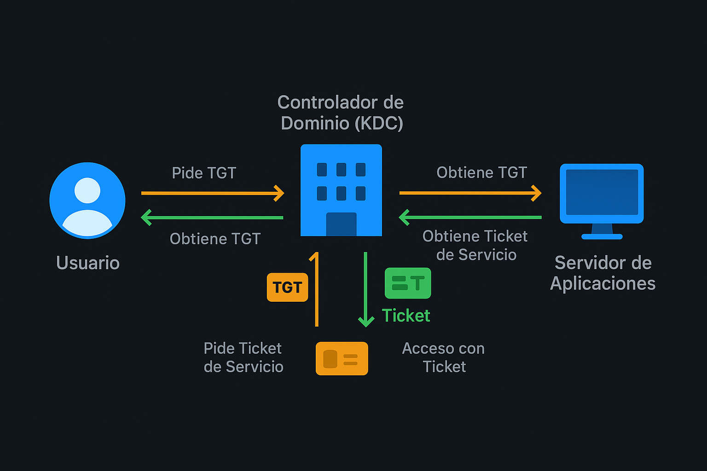
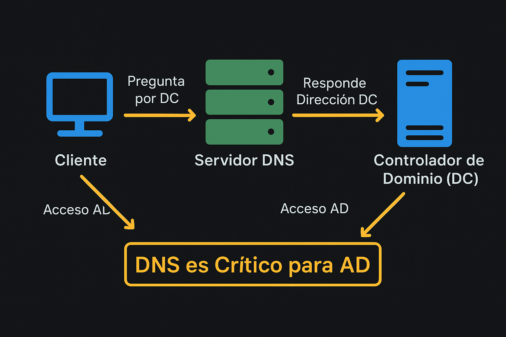

Si estás entrando en el mundo de la ciberseguridad, dominar Active Directory es un paso crucial. Este artículo es tu punto de partida: una **introducción a los fundamentos** de AD desde una perspectiva de seguridad. Te explicaremos qué es, cómo funciona y por qué es un objetivo tan valioso para los atacantes. Considera esto la **base teórica indispensable** antes de adentrarte en las **técnicas específicas para protegerlo o comprometerlo**, que serán abordadas en **futuras guías**. **Active Directory es la columna vertebral de la mayoría de las redes corporativas basadas en Windows.** Ignorarlo en ciberseguridad es como intentar defender un fuerte sin proteger su puerta principal ni el almacén de suministros.
## ¿Qué es Active Directory en Esencia?
Imagina Active Directory (AD DS - Active Directory Domain Services) como una base de datos masiva y centralizada que organiza, gestiona y controla el acceso a todos los recursos en una red corporativa. Estos recursos incluyen:

*   **Usuarios:** Las personas que acceden a la red.
*   **Equipos:** Las estaciones de trabajo, servidores, portátiles, etc.
*   **Grupos:** Colecciones de usuarios y/o equipos que simplifican la asignación de permisos.
*   **Aplicaciones y Servicios:** Software y funcionalidades que requieren autenticación.

En lugar de tener que gestionar cada usuario y cada equipo individualmente en cada recurso, AD te permite hacerlo todo desde un punto central.

## Active Directory: ¿Por Qué es Crítico para la Ciberseguridad?

Aquí está el quid de la cuestión para nosotros: AD no solo gestiona quiénes son los usuarios y los equipos (autenticación), sino también **a qué tienen derecho a acceder** (autorización).

Si un atacante logra comprometer Active Directory, obtiene la capacidad de:

1.  Crear cuentas de administrador maliciosas: Dándose acceso ilimitado a la red.
2.  Restablecer contraseñas: Tomando el control de cuentas existentes, incluso las de otros administradores.
3.  Modificar permisos: Concediéndose acceso a datos y sistemas sensibles.
4.  Desplegar malware: Utilizando mecanismos de gestión centralizada como las Políticas de Grupo.
5.  Hacerse pasar por cualquier usuario o servicio: Accediendo a recursos sin ser detectado fácilmente.

En resumen, controlar AD es controlar la red. Por eso, entender su funcionamiento y cómo asegurarlo es absolutamente fundamental.

## Los Bloques Fundamentales de AD (y su Relevancia para la Seguridad)

Para entender la seguridad de AD, primero necesitas conocer sus componentes clave:

### Dominio
Es el límite de seguridad básico. Todos los objetos dentro de un dominio comparten la misma base de datos de cuentas, políticas de seguridad y relaciones de confianza. Si se compromete un dominio, el daño suele estar contenido dentro de él (a menos que haya confianzas mal configuradas).

> **Explicación:** Esta imagen muestra la estructura fundamental de un dominio de Active Directory. Puedes ver los **Controladores de Dominio (DC)** que alojan la **Base de Datos de AD (NTDS.DIT)** y cómo las **Unidades Organizativas (OUs)** organizan los principales tipos de **Objetos** (Usuario, Equipo, Grupo) dentro de ese dominio. Comprender esta organización es el primer paso para entender cómo se gestiona y, por lo tanto, cómo se protege.
---

### Controlador de Dominio (DC - Domain Controller)
Este es un servidor crítico que aloja una copia de la base de datos de AD. Los DCs son responsables de procesar todas las solicitudes de autenticación y autorización. **Comprometer un DC es, para muchos atacantes, el objetivo final.**

---

> **Explicación:** Esta imagen destaca la relación entre un **Controlador de Dominio (DC)** y el archivo **NTDS.DIT**, que es la base de datos real de Active Directory. La advertencia clave aquí, crucial para la seguridad, es que el **NTDS.DIT "CONTIENE HASHES"**. Estos hashes son el objetivo principal de muchos ataques de robo de credenciales.
---

### La Base de Datos de AD (NTDS.DIT)
Este es el archivo físico en un DC que contiene toda la información de AD: usuarios, grupos, equipos, OUs, GPOs y, **crucialmente desde la perspectiva de seguridad, los hashes de las contraseñas de los usuarios y las cuentas de servicio**. Extraer este archivo o los hashes de memoria (`lsass.exe`) es una técnica de ataque muy común.

*   *Particiones:* Dentro del archivo `NTDS.DIT`, la base de datos se divide lógicamente en "particiones" o "contextos de nomenclatura". Las más relevantes son la partición de Dominio (objetos del dominio), la de Esquema (define los tipos de objetos) y la de Configuración (información a nivel de bosque). Estas particiones se replican entre los DCs.

### Unidades Organizativas (OUs - Organizational Units)

Son contenedores dentro de un dominio que te permiten organizar objetos (usuarios, grupos, equipos, otras OUs) de forma jerárquica. Las OUs son vitales por dos motivos clave de seguridad y gestión:

1.  **Aplicación de Políticas de Grupo (GPOs):** Las GPOs son configuraciones (desde políticas de contraseñas hasta configuraciones de firewall o restricciones de software) que se enlazan a OUs (o dominios/sitios) y se aplican automáticamente a los objetos dentro de ellas. Son una herramienta de seguridad poderosísima, pero también un vector de ataque si un atacante puede modificar una GPO o enlazar una GPO maliciosa a una OU.
2.  **Delegación Administrativa:** Puedes asignar permisos administrativos *específicos* sobre los objetos dentro de una OU a un usuario o grupo sin darles control total del dominio. Esto es fundamental para implementar el principio del menor privilegio, limitando el daño si una cuenta administrativa delegada es comprometida.

### Confianzas (Trusts)

Relaciones entre dominios o bosques que permiten a los usuarios de un dominio acceder a recursos en otro. Una confianza mal configurada puede permitir a un atacante pivotar de un dominio (quizás menos seguro) a otro dentro de la organización.

---

> **Explicación:** Esta imagen ilustra estructuras de Active Directory más grandes que un solo dominio. Muestra cómo múltiples dominios pueden formar un **Árbol** y cómo árboles separados o dominios independientes pueden formar un **Bosque**. La clave para la seguridad en estos entornos extendidos son las **Confianzas (Trusts)** que se establecen entre ellos. Entender cómo funcionan estas confianzas es crucial para analizar rutas de movimiento lateral entre dominios o bosques.
---

### Catálogo Global (GC - Global Catalog)

Un controlador de dominio configurado como Catálogo Global almacena una réplica *parcial* de todos los objetos de *todos* los dominios del bosque. Esto permite a los usuarios y aplicaciones realizar búsquedas rápidas de objetos (como usuarios o grupos) en cualquier dominio del bosque sin tener que contactar a un DC de cada dominio.

---

> **Explicación:** Esta imagen muestra cómo un **Controlador de Dominio (DC)** puede funcionar como **Catálogo Global (GC)**, conteniendo una réplica parcial de objetos de otros dominios en el bosque. Esto facilita la búsqueda rápida de recursos a través de múltiples dominios, pero también significa que el GC contiene información replicada de todo el bosque, lo cual es relevante en un contexto de reconocimiento por parte de un atacante.
---

## Gestionando Identidades: Usuarios, Cuentas de Servicio y Grupos (La Base de los Permisos)

La seguridad en AD gira en torno a las identidades y cómo se les otorgan permisos:
### Objetos de Usuario y Cuentas de Servicio
*   **Cuentas de Usuario:** Representan a personas. Contienen información como el nombre, SID (identificador de seguridad único), y las pertenencias a grupos. Proteger las credenciales (contraseñas) de los usuarios es una batalla constante (phishing, fuerza bruta).
*   **Cuentas de Servicio:** Son cuentas de usuario o de equipo utilizadas por aplicaciones y servicios para autenticarse en AD y acceder a recursos. Históricamente, han sido un punto débil de seguridad porque a menudo se les asignan contraseñas que no cambian o que son conocidas por múltiples administradores, y a veces tienen permisos excesivos. Son un objetivo principal para ataques como **Kerberoasting** (atacar los hashes de sus contraseñas).
*   **Cuentas de Servicio Administradas (MSA/gMSA/dMSA):** Microsoft ha evolucionado las cuentas de servicio para mejorar la seguridad:
    *   **MSA (Managed Service Accounts):** Gestionan automáticamente su propia contraseña, reduciendo el riesgo, pero están ligadas a un solo servidor.
    *   **gMSA (Group Managed Service Accounts):** Extienden las MSA a múltiples servidores (granjas). La gestión de contraseñas es automática y compleja, lo que las hace mucho más seguras que las cuentas de servicio tradicionales.
    *   **dMSA (Delegated Managed Service Accounts - Windows Server 2025+):** Un tipo más nuevo que mejora la seguridad al usar claves vinculadas a la identidad del dispositivo y deshabilitar las contraseñas tradicionales, mitigando aún más la recolección de credenciales. Son más seguras y fáciles de gestionar en entornos modernos.
*   *¿Por qué son importantes para la seguridad?* Identificar y proteger las cuentas de servicio, migrando a gMSAs/dMSAs donde sea posible, es crucial para reducir la superficie de ataque.

### Objetos de Grupo
*   Son colecciones de usuarios y/o equipos. Su propósito principal es simplificar la asignación de permisos. Es mucho más fácil asignar permisos a un grupo "Contabilidad" que a cada usuario de contabilidad individualmente.
*   *Tipos de Grupo:*
    *   **Grupos de Seguridad:** Son los que se utilizan para asignar permisos de acceso a recursos. Son los más importantes desde una perspectiva de seguridad.
    *   **Grupos de Distribución:** Se usan solo para listas de correo electrónico, no tienen relevancia de seguridad para permisos.
*   *Ámbitos del Grupo:* Definen dónde puedes usar el grupo y quién puede ser miembro (Local, Dominio Local, Global, Universal). Entender los ámbitos es necesario para diseñar una estrategia de permisos segura y eficiente (aunque no entremos en AGDLP aquí, se basa en esto). Una configuración incorrecta de los ámbitos puede resultar en permisos excesivos o a rutas de escalada inesperadas.
*   *Grupos Privilegiados:* Ciertos grupos incorporados en AD son extremadamente poderosos (ej: `Domain Admins`, `Enterprise Admins`, `Schema Admins`, `Builtin Administrators`). La membresía en estos grupos debe ser mínima, controlada y monitoreada rigurosamente.

### Objetos de Equipo
Representan a las máquinas unidas al dominio. Los equipos también tienen una cuenta en AD (con una contraseña que se gestiona automáticamente) y son entidades de seguridad. Pueden ser miembros de grupos y, como vimos, se les aplican GPOs. Asegurar los equipos (endurecimiento, parcheo, EDR) es parte de la protección del perímetro de AD.

---

> **Explicación:** Esta imagen desglosa los tipos principales de **Objetos** en Active Directory: **Usuario**, **Equipo** y **Grupo**. Muestra ejemplos de los **Atributos** asociados a cada uno, como el nombre de usuario, el SID (que es fundamental para la seguridad y los permisos), el sistema operativo, etc. Comprender estos objetos y sus atributos es clave para enumerar y entender la información dentro de AD.
---

### ACL (Listas de Control de Acceso)

Los permisos para acceder a recursos se definen utilizando ACLs, que son listas de Entradas de Control de Acceso (ACEs). Cada ACE especifica un **Identificador de Seguridad (SID)** (para un usuario o grupo) y los permisos que tiene o no tiene sobre un objeto.

---

> **Explicación:** Esta imagen ilustra cómo funciona una **Lista de Control de Acceso (ACL)**. Muestra cómo un **Usuario** (identificado por su SID) o un **Grupo** (identificado por su SID) tienen permisos específicos definidos en la ACL para acceder a un **Recurso Protegido**. También destaca el **Grupo Crítico "DOMAIN ADMINS"**, cuya membresía implica permisos casi totales, haciendo que las ACLs aplicadas a objetos sensibles y la membresía en grupos privilegiados sean puntos focales para la seguridad y las auditorías.
---

## Protocolos de Autenticación (y sus Implicaciones de Seguridad)

Cuando un usuario o equipo intenta acceder a un recurso en el dominio, AD utiliza protocolos para verificar su identidad:
### Kerberos
El protocolo de autenticación principal y más seguro (si está bien configurado) en AD. Utiliza un sistema de tickets.

---

> **Explicación:** Esta imagen es un diagrama simplificado del proceso de autenticación **Kerberos**. Muestra cómo un **Usuario** interactúa con el **Controlador de Dominio (KDC)** para obtener primero un **Ticket Granting Ticket (TGT)** y luego, usando el TGT, solicita un **Ticket de Servicio** para acceder a un **Servidor de Aplicaciones**. Este proceso basado en tickets es fundamental para entender ataques como **Pass-the-Ticket** o **Kerberoasting**.
---
### NTLM (NT LAN Manager)
Un protocolo más antiguo y menos seguro. Todavía se usa como fallback. **Es altamente vulnerable a ataques de retransmisión y Pass-the-Hash**. Restringir o deshabilitar NTLM es una práctica de seguridad recomendada.

## Cómo se Conectan las Piezas: GPOs y DNS
### Políticas de Grupo (GPOs)
Como mencionamos, son la forma principal de empujar configuraciones (incluida la seguridad) a usuarios y equipos.

---

> **Explicación:** Esta imagen visualiza cómo un **Controlador de Dominio (DC)** es responsable de aplicar las **Políticas de Grupo (GPO)** a los **Usuarios** y **Equipos** del dominio. Las GPOs son esenciales para establecer configuraciones de seguridad consistentes, pero si un atacante puede controlarlas, puede implementar código malicioso o deshabilitar defensas en un gran número de sistemas.
---

### DNS (Domain Name System)
AD depende críticamente de DNS. Los clientes usan DNS para encontrar los Controladores de Dominio y otros servicios de AD.

---

> **Explicación:** Esta imagen ilustra la dependencia vital de Active Directory en **DNS**. Muestra cómo un **Cliente** pregunta a un **Servidor DNS** para encontrar la dirección de un **Controlador de Dominio (DC)** y poder así autenticarse y acceder a AD. Esto subraya por qué la seguridad de la infraestructura DNS es una parte integral de la seguridad de Active Directory.
---
## Vectores de Ataque Comunes (El 'Cómo' Atacan AD)
Los atacantes tienen una serie de técnicas probadas para comprometer AD, muchas de las cuales se basan en explotar los conceptos que acabamos de ver:

*   **Reconocimiento/Enumeración:** Usar herramientas (`PowerShell`, `AdFind`, `BloodHound`) para mapear la estructura de AD, identificar usuarios, grupos (especialmente los privilegiados), OUs, GPOs, DCs, shares, etc. Buscan información que les permita planificar los siguientes pasos.
*   **Robo de Credenciales:**
    *   Phishing/Fuerza Bruta: Obtener contraseñas por engaño o adivinación.
    *   Dumpeo de Memoria (`lsass.exe`): Extraer hashes de contraseñas o tickets Kerberos de la memoria de procesos clave usando herramientas como `Mimikatz`.
    *   **Pass-the-Hash / Pass-the-Ticket:** Reutilizar hashes o tickets robados para autenticarse en otros sistemas sin conocer la contraseña real.
    *   **Kerberoasting / AS-REP Roasting:** Atacar las contraseñas de cuentas de servicio o usuarios con configuraciones débiles solicitando hashes descifrables.
    *   **DC Sync / DC Shadow:** Técnicas avanzadas para simular la replicación de AD y forzar a un DC a entregar hashes de contraseñas.
*   **Escalada de Privilegios:** Una vez dentro, buscan convertirse en administradores del dominio, a menudo explotando:
    *   Permisos de ACL mal configurados en objetos de AD (identificado a menudo con `BloodHound`).
    *   Vulnerabilidades en GPOs (poder modificar o enlazar GPOs).
    *   Vulnerabilidades de seguridad conocidas en los sistemas Windows/AD (ej: Zerologon - CVE-2020-1472).
    *   Delegación insegura.
*   **Movimiento Lateral:** Usar las credenciales o tickets robados para acceder a otros sistemas dentro del dominio, moviéndose hasta alcanzar sus objetivos (ej: un DC, un servidor de archivos sensible).
*   **Persistencia:** Asegurar el acceso continuo creando cuentas de respaldo, modificando GPOs, o implantando '**Golden Tickets**' (tickets Kerberos falsos que garantizan acceso ilimitado).

## Defendiéndonos: Conceptos Clave de Seguridad en AD
Proteger Active Directory es una de las tareas más importantes para un equipo de seguridad:
*   **Modelo de Administración en Niveles (Tiering):** Una arquitectura de seguridad donde se segmenta la red y las cuentas administrativas según el nivel de privilegio. Las cuentas de Tier 0 *solo* se usan en sistemas de Tier 0 (los DCs).
*   **Principio del Menor Privilegio:** Otorgar solo los permisos estrictamente necesarios a usuarios y grupos. Revisar y limpiar regularmente la membresía de grupos privilegiados.
*   **Hardening de GPOs:** Utilizar GPOs para forzar configuraciones de seguridad (políticas de contraseñas fuertes, bloqueo de NTLM, restricción de software, firewalls, `LAPS` para contraseñas de administrador local únicas).
*   **Auditoría y Monitoreo (¡CRÍTICO!):** Configurar la auditoría detallada en los DCs para registrar eventos clave (inicios de sesión, cambios en grupos/usuarios, cambios en GPOs, acceso a archivos sensibles). **Centralizar estos logs en un SIEM** para detectar actividades sospechosas.
*   **Gestión de Parches:** Mantener DCs, servidores miembro y estaciones de trabajo actualizados con los últimos parches de seguridad.
*   **Protección Avanzada de Credenciales:** Implementar soluciones como Credential Guard para aislar el proceso `lsass.exe` y dificultar el dumpeo de credenciales. Considerar MFA para inicios de sesión administrativos.
*   **Migración a Cuentas de Servicio Seguras:** Transicionar de cuentas de servicio tradicionales a gMSAs o dMSAs.
*   **Revisión Periódica:** Realizar auditorías regulares de la configuración de AD, las ACLs y las GPOs para identificar debilidades. Herramientas como `BloodHound` son excelentes para esto.

## El Mundo Híbrido: Active Directory y Azure AD
Hoy en día, muchas organizaciones tienen entornos híbridos donde el AD local se sincroniza con **Azure AD** (el servicio de directorio en la nube de Microsoft 365/Azure). Aunque comparten el nombre, son tecnológicamente diferentes (Azure AD usa protocolos como OAuth/OpenID Connect/SAML en lugar de Kerberos/NTLM para acceso moderno). Entender cómo funcionan estos entornos híbridos, cómo se sincronizan las identidades y qué riesgos específicos presentan (ej: ataques a la sincronización, protección en la nube con Conditional Access, PIM, Identity Protection) es una extensión necesaria del conocimiento de AD on-premises.

## Poniendo la Teoría en Práctica: Monta Tu Laboratorio de Active Directory
Leer sobre Active Directory es un excelente punto de partida, pero para comprender verdaderamente sus matices, vulnerabilidades y cómo defenderlo, necesitas ensuciarte las manos. Montar tu propio laboratorio aislado es fundamental.

En tu laboratorio, podrás instalar Windows Server, promoverlo a Controlador de Dominio, crear usuarios, grupos y OUs, configurar GPOs, unir máquinas cliente, y luego practicar técnicas ofensivas (¡en un entorno controlado!) y defensivas. Esta experiencia práctica solidificará enormemente los conceptos teóricos.

Para montar un laboratorio básico de AD en tu propia máquina, necesitarás software de virtualización (como VirtualBox, VMware Workstation/Player o Hyper-V) y las ISOs de instalación de Windows Server y alguna versión de cliente (Windows 10/11). Una máquina *host* con al menos **16GB de RAM y espacio de disco suficiente (60GB es un buen punto de partida solo para el SO, pero necesitarás más dependiendo de cuántas VMs y datos incluyas)** es altamente recomendable para poder ejecutar cómodamente al menos un DC y una o dos máquinas cliente simultáneamente.

Hay muchos recursos excelentes para guiarte en la configuración de un laboratorio de AD. Dos canales de YouTube muy recomendados que ofrecen contenido extenso sobre hacking y pentesting de Active Directory (incluyendo la configuración de laboratorios) son:

*   **Hacking Active Directory for Beginners** por **The Cyber Mentor**
    [Hacking Active Directory for Beginners (over 5 hours of content!)](https://www.youtube.com/watch?v=VXxH4n684HE)
*   **PENTESTING EN ENTORNOS EMPRESARIALES (Active Directory)** por **s4vitar**
    [PENTESTING EN ENTORNOS EMPRESARIALES (Active Directory)](https://www.youtube.com/watch?v=-bNb4hwgkCo)
    
Explorar estos materiales te proporcionará los pasos prácticos necesarios para construir tu propio campo de pruebas.
Además de un laboratorio local, considera explorar la opción de montar un laboratorio de Active Directory en la nube, como en Microsoft Azure. Esto te dará experiencia con AD en un entorno de nube y cómo se integra con Azure AD en escenarios híbridos. Es posible configurar un laboratorio gratuito aprovechando los niveles gratuitos de Azure, aunque debes tener cuidado con los costos si superas los límites. Un buen punto de partida para esto es:

*   **Ethical Hacking Lessons: Building Free Active Directory Lab in Azure** en Medium por Kamran Bilgrami:
    [https://kamran-bilgrami.medium.com/ethical-hacking-lessons-building-free-active-directory-lab-in-azure-6c67a7eddd7f](https://kamran-bilgrami.medium.com/ethical-hacking-lessons-building-free-active-directory-lab-in-azure-6c67a7eddd7f)

Una vez que tengas tu laboratorio en funcionamiento, la teoría que has leído en este artículo cobrará mucho más sentido. Podrás ver cómo se aplican las GPOs, cómo se gestionan los permisos con ACLs, cómo funcionan los protocolos de autenticación y, lamentablemente, cuán fáciles pueden ser ciertos ataques si AD no está bien configurado. Esta base práctica te permitirá saber con mucha más claridad qué aspectos de AD necesitas proteger (si trabajas en defensa) o cómo encontrar debilidades (si te enfocas en la ofensiva) y, lo más importante, profundizar en áreas específicas de tu interés.

## Conclusión
Active Directory es mucho más que una simple base de datos de usuarios. Es el pilar central de la seguridad en la mayoría de las redes corporativas Windows. Para cualquier profesional de ciberseguridad, ya sea defensivo (Blue Team) u ofensivo (Red Team), tener un conocimiento sólido de cómo funciona AD, cómo se configura, cómo se protege y cómo se ataca **no es negociable**.

Empieza por familiarizarte con los conceptos aquí expuestos (muchos de ellos visualizados en las imágenes). Luego, **monta tu laboratorio y pon la teoría en práctica**. Finalmente, profundiza en las técnicas de ataque y, lo que es más importante, en las estrategias de defensa y monitoreo. Herramientas como `BloodHound` y la capacidad de analizar logs de seguridad de Windows/AD serán tus mejores amigas en este camino.

Dominar la seguridad de Active Directory te dará una ventaja enorme en el campo de la ciberseguridad y te permitirá proteger organizaciones de manera efectiva contra algunos de los ataques más comunes y devastadores. ¡Manos a la obra!