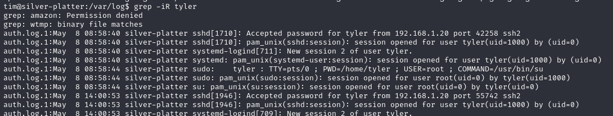

# Silverplatter

## 1. Exploración inicial

Al ingresar a la máquina virtual, encontramos una página web de una empresa que ofrece servicios de hacking. No hay muchos puntos de explotación evidentes, pero en la sección **Contact** encontramos algo llamativo.


## 2. Escaneo de puertos con Nmap

Realizamos un escaneo con `nmap` y encontramos que el puerto **8080** está abierto, mientras que el puerto **80** es utilizado por el servicio web inicial. Además, en la web se menciona un servicio llamado **SilverPeas**, por lo que probamos acceder a través del puerto **8080**.

```bash
nmap -p- 10.10.37.31
```

## 3. Ataque de fuerza bruta en SilverPeas

Al acceder al servicio SilverPeas en el puerto **8080**, nos encontramos con un formulario de autenticación, pero no conocemos la contraseña. Para solucionar esto, utilizamos la herramienta **CEWL** para generar un diccionario de contraseñas a partir de la página web inicial:

```bash
cewl http://10.10.37.31 -w passwords.txt
```

Luego, realizamos un ataque de fuerza bruta con **Hydra**:

```bash
hydra -l scr1ptkiddy -P passwords.txt silverplatter.thm -s 8080 \
http-post-form "/silverpeas/AuthenticationServlet:Login=^USER^&Password=^PASS^&DomainId=0:F=Login or password incorrect"
```

Finalmente, logramos acceder con las siguientes credenciales:

```
Usuario: scr1ptkiddy
Contraseña: adipiscing
```

## 4. Explotación de IDOR (Insecure Direct Object Reference)

Una vez dentro, no encontramos información relevante en las secciones del sitio web. Sin embargo, en la sección de **notificaciones**, encontramos un mensaje con una URL que termina en `ID=5`.


Decidimos probar valores cercanos y al modificarlo a `ID=6`, descubrimos credenciales que podríamos usar para una conexión SSH.

## 5. Acceso SSH y obtención de la primera flag

Probamos las credenciales obtenidas en una conexión SSH:

```bash
ssh tim@10.10.37.31
```

Al ingresar, encontramos un archivo de texto con un mensaje que contiene la **primera flag**.

## 6. Escalada de privilegios a root

Para obtener acceso root, revisamos vulnerabilidades de escalamiento, pero todas están parchadas. Exploramos los logs en busca de información sobre el usuario **Tyler** y encontramos una contraseña filtrada en el servicio **PostgreSQL**:



```
ssh: tyler@10.10.37.31
Contraseña: _Zd_zx7n823
```
Probamos iniciar sesión con este usuario y logramos acceder con éxito.


Ejecutamos el siguiente comando para verificar permisos de `sudo`:

```bash
sudo -l
```


Descubrimos que podemos escalar privilegios a **root**, por lo que procedemos con la escalada.

```bash
sudo su
```


Ahora podemos inspeccionar la carpeta **/root** donde encontramos la **flag final**.


